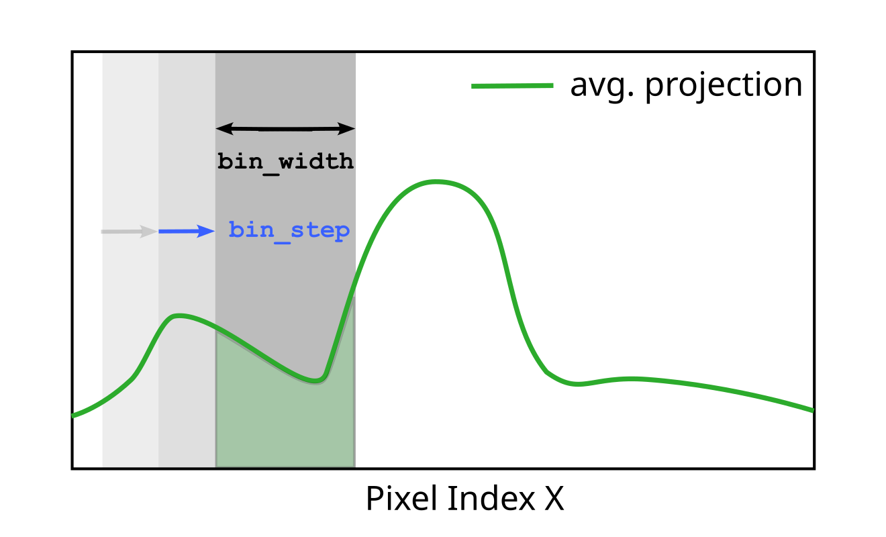
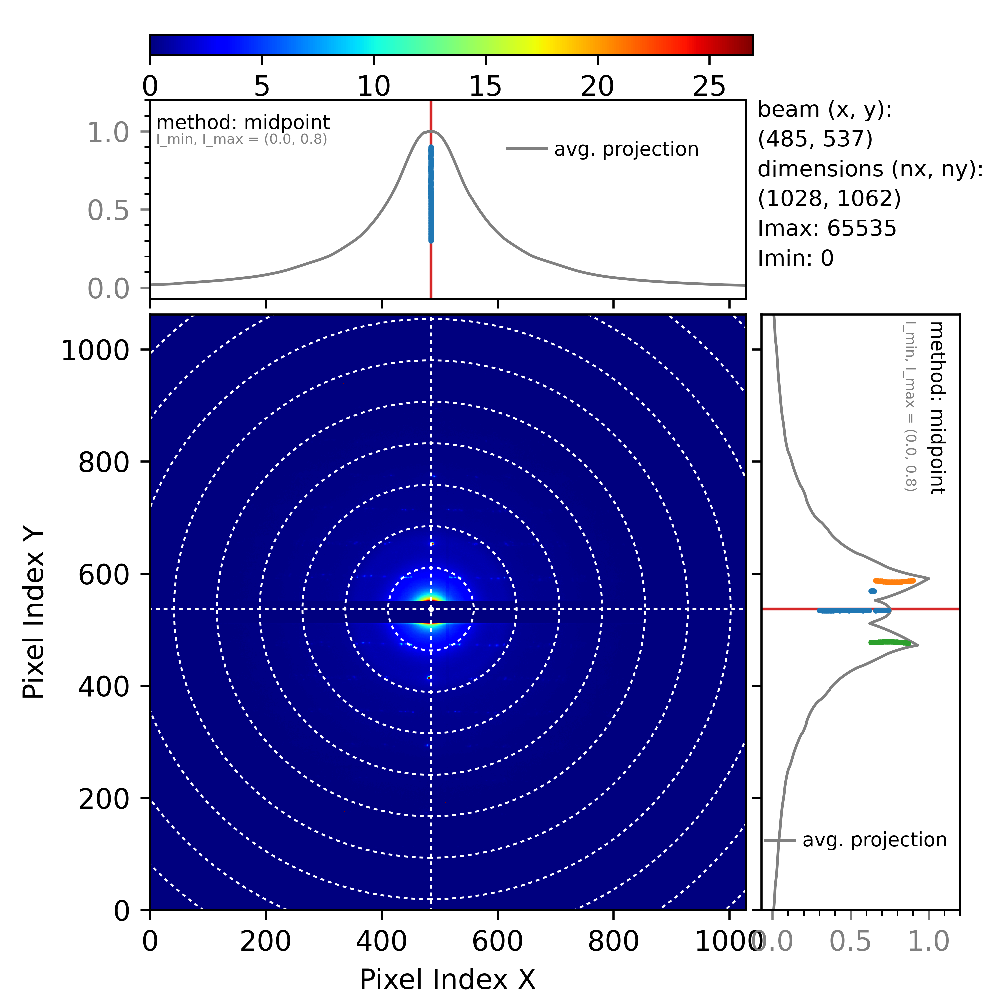
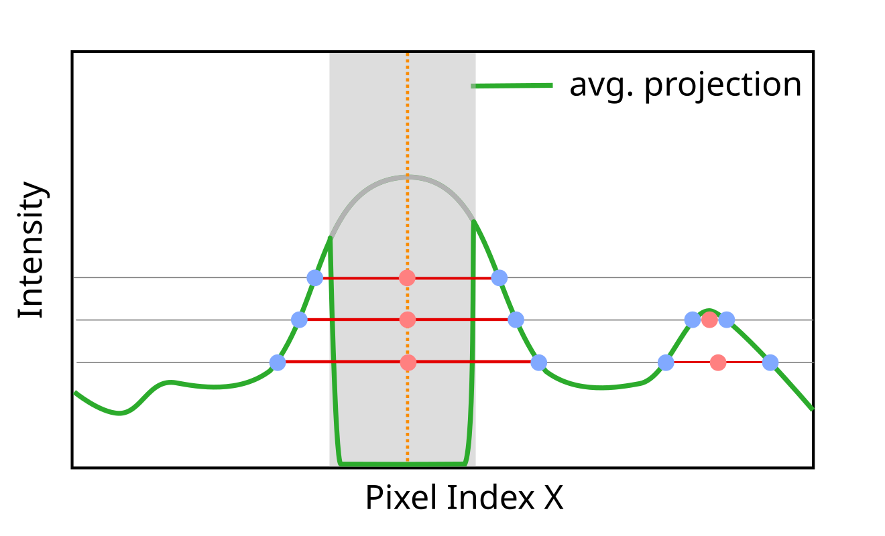
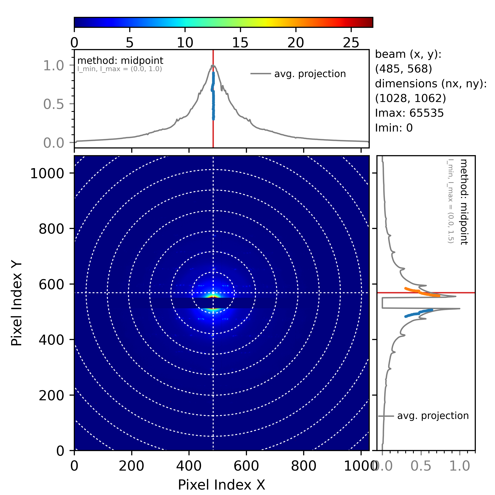
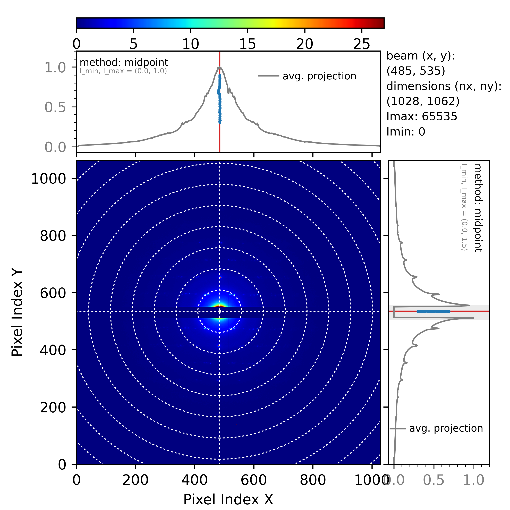
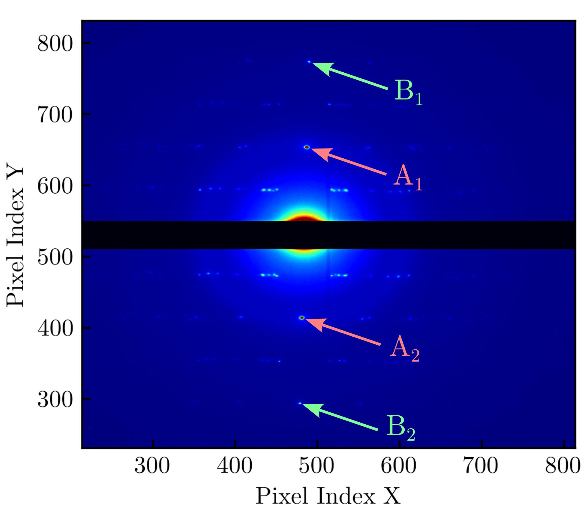
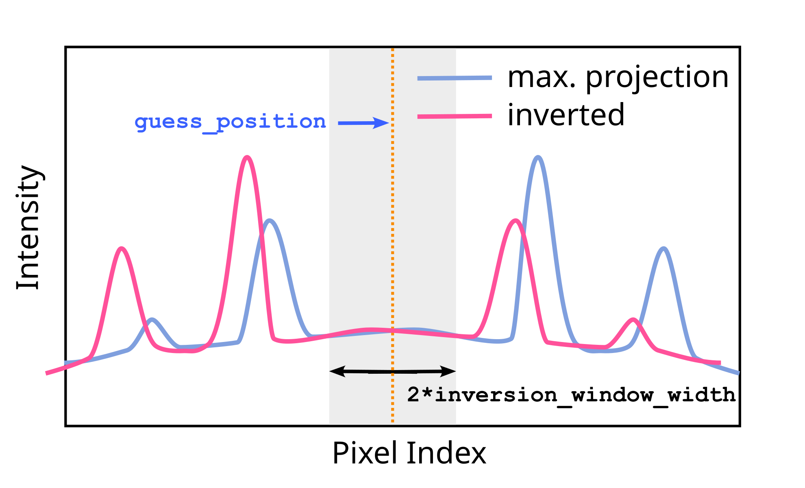

============================
Beam position methods
============================

``dials.search_beam_position`` searches
beam position in a set of diffraction images. There are four 
methods implemented in this function: default, maximum, midpoint, and
inversion. The default method is based on the work of *Sauter et al.*
(please see Ref. [`1 <sauter>`_]) and it is not covered
here. The other three methods are based on projecting diffraction images along
the *x* and the *y* axes, and we will briefly describe them here.

The three projection methods were developed to automate the 
processing of diffraction datasets produced at the DLS electron Bio-Imaging Centre
(eBIC). They are developed primarily for electron diffraction images,
although nothing prevents you from using them for other sources. They work
primarily in cases when the user can quickly determine the beam center just by
looking at a diffraction image, and they do not
rely on some profound mathematical truths. In other words, they are not a 'silver
bullet' to handle every dataset, but an *ad hoc* solution developed to work for
most of the datasets obtained at eBIC. The initial idea was to use the output
of these three methods to train machine learning models (with problematic
datasets labeled by hand in order to catch all the cases).

It is unlikely that any of the three methods presented here will work on your
data out of the box. Depending on the setup of your experiment, detector
resolution, position of the beam stop etc, you will have to tune method 
parameters to fit your experiment. However, once you find the correct
combination of parameters, the methods will work well for most your datasets.
In the first example below (processing with the maximum method) we will just
present the interface of the maximum method. In the second example, beside
explaining the interface of the midpoint method, we will give a step by step
explanation how we tuned the method parameters to work with the Singla data.

*********************************
Maximum pixel intensity method
*********************************
This is the simplest projection method, which is suitable for datasets where 
the beam is visible. Assuming we already imported our dataset with
``dials.import``, we can run the ``search_beam_position`` on the imported
experiment file

.. code-block:: console

   dials.search_beam_position method=maximum image_ranges=0:3 imported.expt

The ``search_beam_position`` command will compute the average diffraction 
image using the first three images in the dataset, and then compute the 
beam position using the maximum pixel intensity method. The 
output should be a single PNG image called ``beam_position.png`` 
(shown below, see Fig. 1).

.. figure:: ../figs/beam_position_maximum.png
   :alt: Beam position computed using maximum method 
   :width: 80%
   :align: center

   Beam position computed using the maximum pixel intensity method.
   Data provided by Peter Ercius from  Lawrence Berkeley National
   Laboratory.

The generated plot shows the average diffraction image in the central part
and two projected profiles along the *x*- and the *y*-direction in the top and
right plots, respectively. The beam position in pixels (rounded to
an integer) is shown in the top right, between the plotted graphs.
The plotted result has additional metadata, such as the image dimensions, the
minimal and maximal pixel intensity, etc. Note that all
projection methods work only for single-panel detectors (for now).

.. note::

   By default, the plotting function will try to adjust the colormap range to 
   show high intensity regions.
   However, in some datasets, the pixel intensities might be unevenly 
   distributed (imagine a dataset where the average pixel has an intensity
   between 0 and 10, but some bad pixels show intensities of several
   millions). In such cases, spotting the beam on the central image would be
   hard. If this is the case with your dataset, you can use the argument
   ``color_cutoff`` (for example, in the previously described case, you would
   ``set color_cutoff=10``) to set the maximum value of the colormap range.
   Setting this parameter will not change the original data; it will only 
   change how it is plotted. Pixels with intensities above the color cutoff 
   would be set to the same color. The ``color_cutoff`` also applies to other
   methods (inversion and midpoint) and is not limited to the maximum method.

When projecting data from a 2D image to 1D profiles, we can
either compute the average pixel intensity along an axis or 
find the maximal pixel along an axis (i.e., computing the maximal projection).
The previous figure shows both maximal and average projections along each axis.

Because the beam is visible, one can  find the pixel with maximum
intensity and declare that to be the beam position without any projecting.
However, this is not always correct. In some cases, bad pixels
will return the maximal intensity from the trusted range by default.
Also, there might be cases where the intensity of a reflection spot is higher
than the intensity at the direct beam. One condition usually
satisfied when the beam is visible is that the direct beam has the most
extensive spread compared to other diffraction spots.
Finding the broadest peak is a good starting point for computing the beam
position. The next step is determining the pixel with the highest intensity 
within that broadest peak. Projecting the diffraction image along the *x* and
the *y* is not necessary. However, it
dramatically simplifies the problem by reducing it to one dimension.
The downside is that there might be cases where strong
reflection spot masks the direct beam in the projected profile. 
Averaging over few images (as in our example above) usually removes this problem.

The first step in the maximum method is to find the broadest peak
in the projected profiles. This is done by scanning the average
projected profile (the green curves in Fig. 1) with an averaging kernel of a
certain width (see Fig. 2, below).

   Parameters ``bin_width`` and ``bin_step`` of the maximum pixel intensity
   method.

The averaging kernel (the dark gray rectangle in Figure 2) sweeps over the
projected profile moving in discrete steps (determined by the ``bin_step``
parameter (in pixels)). The kernel size is set with the ``bin_width`` parameter
(again, in pixels). At each position during the sweep, the kernel computes the
integral sum of the average projected profile beneath the kernel (the
green area below the green curve in Figure 2). After sweeping the entire
profile and computing profile integrals, the maximum method determines the
kernel position where this integral has the maximal value. In general, this
will correspond to an area where most of the projected profile intensity is
located (the broadest peak). For a real-world example, see the gray shaded areas
in projected profiles in Fig. 1. These are kernel positions with maximal
integral, and they indeed correspond to the broadest peak. Depending on the
image dimensions, the beam characteristics, etc, the user will have to 
fine-tune the ``bin_step`` and ``bin_width`` parameters to match the expected
spread of the direct beam for the given experimental setup. To ensure the
continuous sweep across the projected profile, DIALS assumes that ``bin_step``
is always smaller than ``bin_width``, otherwise it will throw an error.

Note that most of the narrow reflection spots will disappear because we are
dealing with the average projected profile when determining the broadest peak.
The user can additionally remove narrow reflection peaks by increasing the
``maximum.convolution_width`` parameter, which sets the width of the
convolution smoothing window before the kernel sweep. Additionally, the user
can set all pixels above a certain intensity to zero in the average
diffraction image (that is, before projecting onto the *x* and *y*-axis). 
This is done using ``maximum.bad_pixel_threshold`` parameter.

The next step after locating the broadest peak is to find the
actual beam position. For this, we use the maximum projected profiles 
(the gray curves in Fig. 1). The maximum projected profile will contain peaks
from the reflections and the direct beam. The method will find a pixel with
the highest intensity within the previously determined maximum kernel
(the gray-shaded areas in the projected plots in Fig. 1). The previous
``maximum.bad_pixel_threshold`` argument
is applied to the central image before data is projected so that it will 
affect both projected profiles (average and maximum).

The ``image_ranges=0:3`` argument uses slicing like the Numpy
library, starting at the first image (index 0) up until the third image.
Image ranges are selected using the Numpy
slice notation, that is, ``start:stop:step``, where any of the three numbers 
can be omitted. Multiple image ranges can be separated by commas
(e.g.,  ``image_ranges=0:3,7:20:2,35,48``) which also
allows for the selection of individual images. The averaging procedure in the
current method is not fully optimized, so instead of waiting for thousands of
images to average, it is much faster to select only a subset of those images
(assuming the beam position does not change much throughout the dataset).
Similarly to the previous parameter, one can additionally use 
``imageset_ranges`` to select between different imagesets (if they are present
in the dataset).

Besides computing the average image and then making the projection, 
the user can compute beam position for each image separately
using ``per_image=True`` parameter. This will produce a series of PNG images.

.. code-block:: console

    beam_position_imageset_00000_image_00000.png
    beam_position_imageset_00000_image_00001.png
    beam_position_imageset_00000_image_00002.png
    beam_position_imageset_00000_image_00003.png
    ...

Each image will contain information about beam position. Additionally, if
``per_image=True``, DIALS will produce ``beam_positions.json`` file with
a list of computed beam positions

.. code-block:: console

    [
        [
            0,
            0,
            294.0,
            261.0
        ],
        [
            1,
            0,
            296.0,
            261.0
        ],
        ...
   ]

Here, the first number in the four-element list is the imageset index, 
the second is the image index, and the third and fourth are beam positions
along the *x* and *y* direction (in pixels). 
The JSON file will have beam positions for all
images and imagesets selected using ``image_ranges`` and ``imageset_ranges``.
In contrast to PNG images, the computed positions are not converted to 
integers (which is not that important for the maximum method, but it is for
the other two projection methods).

The user should also distinguish between method-specific parameters 
(such as ``bin_width`` and ``bin_step``) and parameters such as ``per_image``
and ``image_ranges``, which also apply to other projection methods as well
(see ``dials.search_beam_position -h`` for more info on the function
interface. The parameters that apply to all three projection methods
are under the ``projection`` keyword). Additionally, it is important to
emphasize that most parameters specific to the maximum method (and other
projection methods) apply both to projections along the *x* and the *y* axis
(the mini plots on the top and left in Fig. 1). Some parameters
apply separately to *x* and *y* projection, and we will discuss them below.

************************
Midpoint method
************************
This method is suitable for datasets where direct beam is blocked by some
obstacle (and not fully visible in the diffraction images). Fig. 3 presents
one such dataset. A Singla detector consists of two
panels, with a gap between them. It is common for electron beam to be
positioned in this gap. Determining beam position based on the maximum pixel
intensity is not possible in this case because the beam is hidden.

   A diffraction image from DECTRIS Singla detector at eBIC.

First, let's run the midpoint method on this dataset without any parameters. 

.. code-block:: console

   dials.search_beam_position method=midpoint imported.expt

Because we did not provide ``per_image=True`` parameter, DIALS will go through
all the images in the dataset, compute the average image, project that image 
onto *x* and *y* axis, and compute the midpoints. The output of this command
is ``beam_position.png`` file.

.. _midpoint_01:

   Beam position determined by the midpoint method.

The midpoint method is similar to the maximum method in that the average pixel
intensity is projected. This projected intensity is then smoothed using a
convolution kernel (averaging intensities in a narrow window given by
``midpoint.convolution_width``). As with the maximum method, projecting bad
pixels will create unwanted peaks in the projected profile. To solve this, we
introduce a parameter ``exclude_intensity_percent``. Before DIALS projects 
the diffraction image, it will order all image pixels into a one-dimensional
array of increasing intensity. The ``exclude_intensity_percent`` tells DIALS
to discard the top percentage of these pixels (to set them to zero). For
example, ``exclude_intensity_percent=0.1`` will exclude 0.1 % of these
high-intensity pixels.
To further explain the midpoint method we can focus only on the projection
along the *y* axis.

.. _midpoint_scheme:

   How midpoint method determines the beam position. The green curve is the
   projected average pixel intensity, while the gray shaded rectangle marks
   the area where direct beam is blocked by some obstacle (the beam intensity
   in that region goes to zero).

:numref:`midpoint_scheme` shows the projection profile's appearance when
some obstacle impedes the direct beam. The midpoint method will draw
horizontal lines and
compute the intersection points between these lines and the projected profile
(the blue dots). Next, it will compute the midpoints between the intersections
(the red dots). The average position of the calculated midpoints will
correspond to the beam position (the orange vertical dashed line in 
:numref:`midpoint_scheme`).

The central assumption of the midpoint method is that the projected profile is
a reasonably symmetric function. If the profile is skewed, the position of the
average midpoint would not correspond to the beam position. The skewness might
come from hitting the detector at an angle. :numref:`midpoint_scheme` 
shows the projected profile is normalized (put in the range of values between
zero and one). The number of lines intersecting the projected profile is set
with the ``intersection_range`` parameter. For example, by default, the
intersection range is set from 0.3 to 0.9 with 0.01 distance between the
intersecting lines
(``intersection_range=0.3,0.9,0.01``). With this setting, DIALS will draw
around sixty intersection lines. When using this parameter, keep in mind the
normalization, so always set it in the range between zero and one.

In :numref:`midpoint_01` (the projection along the y-axis on the right), we
see several groups of midpoints (orange, blue, green). Each of these groups
corresponds to a local peak in the projected profile. As shown in 
:numref:`midpoint_scheme`, each intersecting line might intersect several
peaks in the projected profile. The question is: which peak is the direct one?
Here, DIALS does several things. First, it groups all the midpoints into
distinctive groups based on their proximity. The grouping is determined using
the ``distance_threshold`` parameter (currently set to 40 pixels). The
condition for a new midpoint to be included in an existing group is if it is 
within the ``distance_threshold`` of any known group (that is, the group
average position). If the midpoint is not close to any of the existing groups,
it will be added to a new group. Next, groups are ranked based on their
average width. The average width is computed by averaging the widths of all
the intersection lines belonging to a group (see the red horizontal lines in
:numref:`midpoint_scheme`). In the final step, DIALS picks the first three
groups of midpoints with the highest average width and selects the one with
the highest number of midpoints. This last step ensures that we do not pick a
group with only a few intersections (in most cases, the direct beam will have
the highest width and number of midpoints). The beam position is then
computed as the average midpoint position of the selected group. 

Dealing with gap regions
------------------------

By default, DIALS does not know which region of the image corresponds to the
gap. For example, in the case of the Singla detector, all pixels from 512 to
550 along the *y*-axis are in this dead region. Our result along the *y*-axis
in :numref:`midpoint_01` was correct, but it was more a lucky coincidence. 
The wide convolution of the projected profile filled the gap and allowed the 
midpoint method to work as expected. However, if the convolution width was too
narrow (or the gap was too big), the midpoint method might not work as
expected. To explain what we mean, let's run the same command, but let's not 
smooth the projected data. 

.. code-block:: console

   dials.search_beam_position method=midpoint \
                              midpoint.convolution_width=2 imported.expt

.. _midpoint_gap:

   Result from the midpoint method obtained with the command above. 

:numref:`midpoint_gap` shows the wrong beam position along the *y*-axis.
The reason for this error is simple to explain. Without any convolution, 
the projected gap region gets an intensity of zero. The problem here is that
DIALS does not know where the gap is. It treats the two beam tails as two 
separate peaks (that is why there are two groups of midpoints,
orange and blue). To resolve this problem, we need to tell DIALS where the
gap is. 

.. code-block:: console

   dials.search_beam_position method=midpoint \
                              midpoint.convolution_width=2 \
                              dead_pixel_range_y=505,555  imported.expt

This will produce the correct result

.. _midpoint_dead:

   Beam position corrected with ``dead_pixel_range_y`` parameter.

Notice that the dead pixel range along the *y*-axis that we provided as a
parameter is marked with the gray shaded rectangle in the *y*-projected
profile in :numref:`midpoint_dead`. Also, we set the region of dead pixels to
be slightly wider than the actual region (by about five pixels on both sides).
The simple explanation of the ``dead_pixel_range_y`` is that DIALS will ignore
all intersections within this region. This is equivalent to filling the gap
region with infinite intensity. The intersections with the two tails of the
original beam are now accounted for properly, and the midpoint method works
again.  

Equivalently to ``dead_pixel_range_y``, there is a parameter
``dead_pixel_range_x``. Additionally, you can use multiple ranges like
``dead_pixel_range_y=a,b,c,d``. This will set two regions (from ``a`` to
``b``, and from ``c`` to ``d``).

************************
Inversion method
************************

This method is suitable for datasets where one can clearly see Friedel pairs.

.. _inversion_singla:

   Friedel pairs (A1, A2) and (B1, B2) in the Singla diffraction image
   obtained at eBIC.

.. _inversion_method:

   Sketch of the projected profile with Friedel pairs (no direct beam).

For example, :numref:`inversion_singla` shows the previous diffraction image
from Singla, emphasizing two Friedel pairs. Friedel pairs are positioned
symmetrically around the direct beam. In this case, the simplest way to
determine the beam position is to connect a single Friedel pair with a vector
and divide that distance in half. Another approach would be spot-finding first
to determine the positions of Friedel pairs and then compute the midpoints. We
plan to use projection again to simplify the problem in our implementation. To
explain the inversion method, let us assume we make maximum projection along
the *y*-axis
from :numref:`inversion_singla`, and we obtain something similar to the sketch in 
:numref:`inversion_method`. There are four peaks corresponding to two Friedel
pairs. Because of the equal distance from the direct beam to both spots in
every Friedel pair, the beam position becomes the center of inversion for any
projection. The question is how to find this point for four peaks in
:numref:`inversion_method`
automatically. One can connect
the peaks with lines, compute midpoints, and average them, but which peaks
should be connected? In our approach, we use a simple observation. Let's
assume the direct beam is positioned at some point called ``guess_position``
(see :numref:`inversion_method`). We can then invert the projected profile
around this point and obtain the pink curve. If ``guess_position`` is indeed
the center of inversion, the peaks in the inverted curve and those in the
original curve will overlap. If this is not the case, the peaks from one curve
will overlap with some other peaks (with different intensities) or with
low-intensity regions. One way to quantify the overlap between the original
and the inverted curve is to multiply them for each pixel and integrate (sum)
the product. If the overlap is significant, the integral will be large; if the
overlap is low, the integral should be lower. Next, we repeat this procedure
in some regions around the ``guess_position``. We move the ``guess_position``
to every point within this region, multiply the two curves, and compute the
integral to quantify the overlap. Ultimately, we will get a single curve that
quantifies the overlap for a range of pixels. Picking the maximum of this
curve as the beam position means that the computed overlap at that point is
highest, so that point is very likely to be the center of inversion.

.. _sauter:

   `[1] <https://journals.iucr.org/j/issues/2004/03/00/dd5008>`_
   Sauter et al., *J.Appl.Cryst.* **37**, 399-409 (2004).

