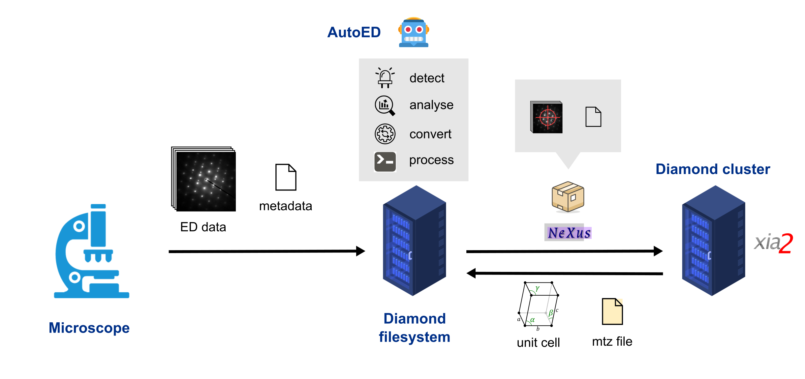

============================
How AutoED works
============================

The figure below shows the basic AutoED workflow. Data is captured on an eBIC
microscope and transferred to the Diamond filesystem (together with
accompanying metadata). The AutoED monitors the Diamond filesystem, detects a
new dataset, analyzes it (determines beam center), converts it to Nexus
format, and (in the end) processes it using xia2. 

   The AutoED workflow: the data can be processed remotely on the Diamond
   cluster (as shown in the figure) or locally on the same machine running
   AutoED. See option ``local`` in the configuration file for more details.

What makes a dataset?
......................

A dataset consists of several files. By default, the Singla detector
writes at least two HDF5 files: a data file (e.g.,
``20250522_nav15_data_000001.h5``)
and a master file (e.g., ``20250522_nav15_master.h5``). The file names 
include a basename (e.g., ``20250522_nav15``) and an extension (e.g.,
``_master.h5``, or ``_data_000001.h5``). The basename is usually a 
combination of metadata, like the date and time the data is collected. From
now on, we will write ``basename`` instead of its actual value. Besides these
two files, in our setup, the detector produces an additional
metadata file (e.g., ``basename.json``). This metadata file contains all
the information necessary to populate the Nexus file that AutoED
generates (e.g., ``basename.nxs``). An example of an JSON metadata file is 
given below

.. code-block:: console

   {
    "voltage": 200.0,
    "wavelength": 0.02507934052490744,
    "rotation_speed": "1",
    "start_angle": -60.0,
    "frame_rate": 2.0,
    "angle_increment": 0.5,
    "detector_distance": 1759.5,
    "sample_type": "macro",
    "unit_cell": null,
    "space_group": "P1"
   }

AutoED will consider a dataset complete (and process it) only when all
three files (a data file, a master file, and a metadata file) are present in the 
same directory. The data file is usually large,
and it takes some time to get copied from the microscope to the Diamond
filesystem. To prevent data processing before the file is
entirely copied, the AutoED relies on a trigger file.
When the microscope finishes writing a dataset, it writes a
trigger file in the same directory. The AutoED waits for this file to appear,
and then searches for master files in that directory. If there are several 
datasets in a directory, creating (or modifying) a trigger file in that
directory will trigger the processing of all datasets in that directory. 
The search also works recursively on all subdirectories of a directory where
the trigger file appeared. 

Additionally, data
will only be processed if it's inside a data root directory. In our case, the
data root directory is called ``ED``. The data organization inside the root
(``ED``) directory is left to the user. You can group your data and have as many
subdirectories as you like. However, AutoED makes some assumptions about how
data is organized when it processes combined datasets of a single sample using
xia2 multiplex. More info can be found on the 
:doc:`page about multiplex<multiplex>`.

Testing it out
......................

Here is a simple example of how to test if AutoED is working. We will
trigger processing ourselves (instead of waiting for the microscope to do it).
Assume some diffraction images are saved in
``/home/some_user/diffraction/ED/dataset_01``. If we list this directory, we
get a single dataset.

.. code-block:: console

    ls /home/some_user/diffraction/ED/dataset_01
      20240522_1235_nav17_data_000001.h5
      20240522_1235_nav17_master.h5
      20240522_1235_nav17.json

First, we start the AutoED daemon, and we start watching the diffraction
directory

.. code-block:: console

    autoed start
    autoed watch /home/some_user/diffraction

Next, we trigger the processing by creating a trigger file (a hidden file
called ``.HiMarko``). The name of the trigger file can be changed in the
global configuration file (see more about that in the section
about :doc:`configuring AutoED<configuring_autoed>`).

.. code-block:: console

    touch /home/some_user/diffraction/ED/dataset_01/.HiMarko

The AutoED will search the ``dataset_01`` directory, find the master
file, derive the dataset name from the master file, check if data and metadata
files are present, and then process our
dataset. If we list the same directory after processing we should see
something like this

.. code-block:: console

    ls /home/some_user/diffraction/ED/dataset_01
      20240522_1235_nav17_data_000001.h5
      20240522_1235_nav17_master.h5
      20240522_1235_nav17.json
      beam_position.png
      spots.png
      spots_log.png
      20240522_1235_nav17.autoed.log
      20240522_1235_nav17.nxs
      ...
     
AutoED generated a Nexus file, a local log file, a figure showing the computed
beam position, etc. If we list the diffraction directory, we get

.. code-block:: console

    ls /home/some_user/diffraction
      autoed_report
      processed
      ED
      ...

There is the ``processed`` directory where AutoED keeps the results of xia2
processing, and the ``autoed_report`` directory with the summary of processing
statistics. If you process more datasets, you might also see a ``multiplex``
directory.  

A single dataset is processed several times through the so-called pipelines. A
pipeline is just a sequence of DIALS or xia2 commands with different options.
For example, there is a pipeline that checks if there are multiple lattices in
the sample or a pipeline that checks if the sample is an ice crystal. The
output from all pipelines is saved in the ``processed`` directory. For the
dataset we processed above, the output for the default pipeline would be in
``/home/some_user/diffraction/processed/dataset_01/default``.
Predefined pipelines can be found and modified in the global configuration file. 

.. _local-note:

.. important::

    By default, AutoED is set to run on a Diamond server and submit jobs to
    the Diamond cluster using SLURM REST API. If you use AutoED outside of
    Diamond, you can set it to run in local mode (without
    submitting jobs to SLURM). The option :code:`local` needs to be set to
    :code:`true` in your local configuration file. Otherwise, AutoED will
    probably not work on your system. See
    :doc:`how to configure AutoED<configuring_autoed>`
    for more information. When running in the local mode, each pipeline is run
    serially (in a sequence), whereas when running with SLURM (on the
    cluster), pipelines are processed in parallel. Therefore, running in the
    local mode can be slower, and you should consider reducing the number of
    active pipelines to speed up the processing. 

